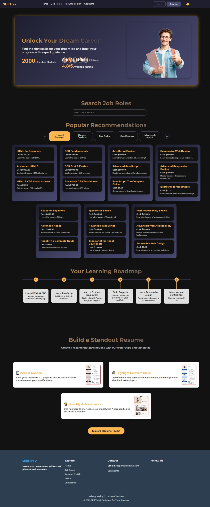

# 🎓 SkillTrak – Your Career Skill Companion

**SkillTrak** is a sleek, web-based platform built to help students, freshers, and job seekers navigate their career paths. It offers curated roadmaps, skill quizzes, resume resources, and course recommendations – all tailored by job role and industry.

---

## 🌟 Features

- 🧭 **Role-Based Roadmaps** – Step-by-step learning paths for 40+ job roles across 15 industries.
- 🧠 **Skill Quizzes** – Assess your knowledge with interactive quizzes (15 questions per step).
- 🎓 **Course Recommendations** – Personalized courses mapped to skills for each job role.
- 📝 **Resume Toolkit** – Access to professional resume templates.
- 📊 **Progress Tracking** – Monitor your journey as you grow in your chosen role.

---

## 🛠️ Tech Stack

- **Frontend**: HTML, CSS, JavaScript  
- **Backend**: Python (Flask), MySQL  
- **UI/UX Design**: Figma

---

## 🚧 Project Status

🔧 In active development – backend and additional features coming soon.

---

## 📁 Folder Highlights

- templates/ – All HTML files
- static/css/ – Stylesheets
- static/js/ – JavaScript files
- static/images/ – All icons, illustrations, and images used in the UI
- app.py – Flask app file (to be implemented)

---

## 📸 Preview

Here’s a quick look at SkillTrak:

---

## 📬 Get in Touch

Have feedback or want to collaborate? Feel free to reach out!  

 jilsamariya2412@gmail.com

---

